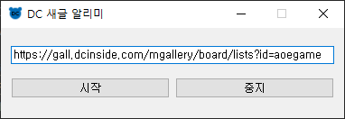
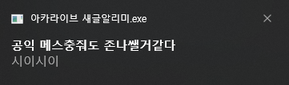
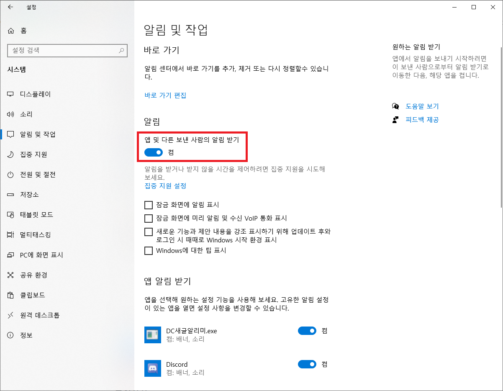
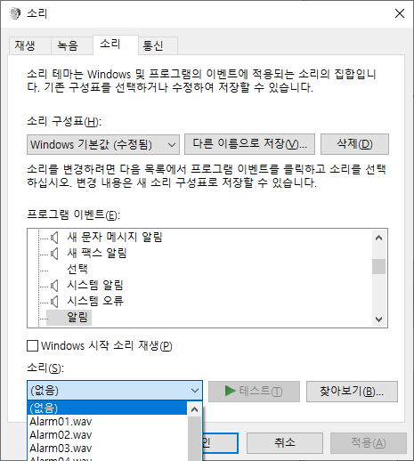

# 아카라이브 새글 알리미
* 아카라이브 새글 알리미는 [__DC 새글 알리미__](https://github.com/aldlfkahs/DCinsideAlarm)를 기반으로 만들어졌습니다.

</img> 
</img> 

아카라이브 특정 채널에 새로운 글이 올라오면 윈도우10 팝업 메시지로 알려주는 프로그램입니다.  
새 글 알림을 받고 싶은 채널의 메인 페이지 주소를 적은 뒤, 시작 버튼을 누르면 됩니다.  
__반드시 사용 전 설정사항과 주의사항을 읽으신 뒤에 사용해주세요!__  
다운로드는 [__여기를 클릭__](https://drive.google.com/file/d/12KvWQxH9sYQ7Wpg6v8TmSr67ZNVq9MkQ/view?usp=sharing)해주세요.  (비밀번호 : 11037)  

### 사용법
1. 알림을 받고 싶은 채널의 메인 페이지 주소를 '채널 주소'칸에 적습니다.  
2. 시작 버튼을 누르면 알림이 시작 됩니다.  
3. 알림 메시지 클릭시 해당 글이 브라우저로 열립니다.  
##### 키워드 알리미 사용법
1. 키워드 옆에 ON 버튼을 클릭하여 키워드 기능을 활성화 합니다.  
2. ON/OFF 옆에 있는 텍스트 창에 추가하고 싶은 키워드를 적고, 추가 버튼을 누릅니다.  
3. 삭제하고 싶은 키워드를 클릭 후, 삭제 버튼으로 삭제할 수 있습니다.  
* 키워드 ON/OFF 및 추가/삭제는 알림이 실행되는 도중에도 변경 가능합니다.  
##### 키워드 저장/불러오기 사용법
1. 저장 버튼을 누르면 현재 쓰여있는 채널 주소, 키워드를 저장할 수 있습니다.
2. 불러오기 버튼을 누르면 이전에 저장해 두었던 개럴리 주소, 키워드를 불러올 수 있습니다.
### 주의사항
프로그램 종료 시, 중지 버튼을 누른 뒤에 종료해주세요.  
채널 주소는 https:// 를 포함한 전체 주소를 써주세요.

### ★사용 전 설정사항★

__필수 설정 사항__  
시작->설정->시스템->알림 및 작업  
앱 및 다른 보낸사람의 알림 받기 -> 켬  
</img> 

__전체 화면에서도 알림을 받고 싶다면?__  
시작->설정->시스템->집중 지원  
모든 설정 해제 및 끔으로 변경  
</img> 

__알림 소리를 끄고 싶다면?__  
알림 및 작업->알림이 소리를 재생하도록 허용 체크 해제  
</img> 

### 배포 버전

1.4.0버전  
-DC새글알리미의 1.4.0버전을 기준으로 수정되었습니다.

현재 확인된 버그  
-간헐적으로 프로그램이 제대로 종료되지 않는 현상  

### 문의

이메일 : aldlfkahs95@naver.com  
블로그 : https://togomi.tistory.com/27
        
