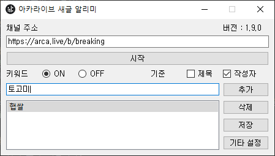

# DC 새글 알리미

</img> 
</img> 

디씨인사이드 특정 갤러리에 새로운 글이 올라오면 윈도우10 팝업 메시지로 알려주는 프로그램입니다.  
새 글 알림을 받고 싶은 갤러리의 메인 페이지 주소를 적은 뒤, 시작 버튼을 누르면 됩니다.  
__반드시 사용 전 설정사항과 주의사항을 읽으신 뒤에 사용해주세요!__  

[__다운로드__](https://drive.google.com/file/d/1X0-OBHHe3yGTKRxjnuIiJiA2k4MTPA6q/view?usp=sharing)  
(비밀번호 : 11037)  

### 사용법
1. 알림을 받고 싶은 갤러리의 메인 페이지 주소를 '갤러리 주소'칸에 적습니다.  
2. 시작 버튼을 누르면 알림이 시작 됩니다.  
3. 알림 메시지 클릭시 해당 글이 브라우저로 열립니다.  
##### 키워드 알리미 사용법
1. 키워드 옆에 ON 버튼을 클릭하여 키워드 기능을 활성화 합니다.  
2. ON/OFF 옆에 있는 텍스트 창에 추가하고 싶은 키워드를 적고, 추가 버튼을 누릅니다.  
3. 키워드 알림 기준을 체크 합니다. (제목 or 작성자) (중복 가능)  
4. 말머리 별로 알림을 받고 싶은 경우 해당하는 말머리를 "[말머리]" 형식으로 키워드에 추가합니다.  
5. 삭제하고 싶은 키워드를 클릭 후, 삭제 버튼으로 삭제할 수 있습니다.  
##### 설정 저장/불러오기 사용법
1. 저장 버튼을 누르면 현재 쓰여있는 채널 주소, 키워드를 저장할 수 있습니다. 해당 정보는 프로그램과 같은 경로에 config.yaml로 저장됩니다.  
2. 프로그램 재시작 시, config.yaml 정보를 기반으로 자동으로 불러오기가 됩니다.  
##### 모바일 알리미 사용법
1. 기타 설정버튼을 누른 후 알림 방식을 선택합니다.  
2. 알림을 받고 싶은 이메일과 비밀번호를 적습니다.  
3. 해당 정보를 저장/불러오기 하고싶다면 하단에 default를 클릭하고(혹은 새로운 이름을 적고) 저장/불러오기를 눌러주세요.  
* 이메일/비밀번호 정보는 사용자 로컬 컴퓨터에만 저장되니 걱정하지 마세요!  
##### 이메일 설정법
* 이메일 연동을 위해 사용하고자 하는 이메일 서비스에서 해당 계정의 IMAP/SMTP 설정을 활성화 해주셔야 합니다.  
* 해당 계정이 2단계 인증을 사용중인 경우 추가적으로 앱 비밀번호를 생성하여 알리미에 앱 비밀번호를 기입하여 사용하시면 됩니다.  
  * __단, 구글의 Gmail 같은 경우 2단계 인증 미사용시 서드 파티 앱에서의 사용을 더 이상 지원하지 않기 때문에 Gmail 사용자의 경우 계정 2단계 인증 후 앱 비밀번호를 설정하여 사용하시기 바랍니다.__  
* 대부분의 이메일 서비스는 연동이 가능하며 대표적으로 구글, 네이버, 다음의 고객센터 문서 기준 설정법은 각각 다음과 같습니다.  
  * 구글 앱 비밀번호 및 IMAP 설정: https://support.google.com/a/answer/9003945  
  * 네이버 IMAP 설정: https://help.naver.com/service/5632/contents/18534  
  * 네이버 앱 비밀번호 설정: https://help.naver.com/service/5640/contents/8584  
  * 다음 IMAP 설정: https://cs.daum.net/faq/43/9234.html?faqId=24099  
  * 다음 앱 비밀번호 설정: https://cs.daum.net/faq/43/9234.html?faqId=33671  
### 주의사항
갤러리 주소는 https:// 를 포함한 전체 주소를 써주세요.  

### ★사용 전 설정사항★

__필수 설정 사항__  
시작->설정->시스템->알림 및 작업  
앱 및 다른 보낸사람의 알림 받기 -> 켬  
</img> 

__전체 화면에서도 알림을 받고 싶다면?__  
시작->설정->시스템->집중 지원  
모든 설정 해제 및 끔으로 변경  
</img> 

  
__알림 소리를 끄고 싶다면?__  
알림 및 작업->알림이 소리를 재생하도록 허용 체크 해제  
</img> 

### 배포 버전

1.1버전  
-일시적 오류로 디씨 서버가 터져도, 프로그램이 멈추지 않고 자동으로 재요청하도록 수정했습니다.  

1.2버전  
-정식 갤러리 및 기타 지원되지 않던 마이너갤러리도 지원되도록 수정했습니다.  

1.3.0버전  
-키워드 기능을 추가했습니다.  
-버전 정보를 UI에 추가했습니다.  
-(코드) : 코드를 설명하는 주석을 추가했습니다.  

1.3.1버전  
-팝업 메시지 클릭시 해당 글이 브라우저로 열리는 기능을 추가했습니다.  
-글리젠이 빨라도 이전에 확인하지 못한 글들이 전부 순차적으로 알림이 뜨도록 수정했습니다.  
-프로그램 고정 사이즈를 삭제했습니다.  

1.3.2버전  
-새글 알림시 다음 검색에 2배로 기다리던 현상을 수정했습니다.  
-새글 확인 주기를 4초에서 3초로 감소시켰습니다.  
-한 번에 새글이 많이 올라오면 중지 버튼을 눌러도 제 때 중지되지 않던 현상을 수정했습니다.  

1.4.0버전  
-키워드 저장/불러오기 기능을 추가했습니다.  

1.4.1버전  
-아이콘이 표시되도록 수정했습니다.  

1.5.0버전  
-아이콘 파일이 같은 폴더에 있어야 아이콘이 제대로 보이는 문제점이 수정되었습니다.  
-중지 버튼을 누르지 않고 프로그램 종료시 스레드가 백그라운드에서 계속 돌아가는 버그가 수정되었습니다.  
-시작 버튼을 누를 때 마다 스레드가 새로 생기는 버그가 수정되었습니다.  
-키워드 저장 및 불러오기 기능이 유니코드 문자를 지원하지 않는 버그가 수정되었습니다.  

1.5.1버전  
-신생갤에서 디시 운영자가 올린 글의 글 번호가 가장 커서 알림이 작동하지 않는 버그를 수정했습니다.  
-갤러리의 말머리를 파싱하여, 말머리 리스트에 포함되지 않는 글은 디시 운영자의 글로 판단하여 알림에서 제외하도록 수정했습니다.  
-알림 시작 문구를 수정하였습니다.  

1.5.2버전  
-공지 키워드가 글 목록에 있는 경우, 알림이 오지 않던 버그를 수정했습니다.  
-알림 시작/중지 시, 각 버튼을 활성화/비활성화하도록 수정했습니다.  
-창 크기 조절 시, 키워드 창이 늘어나도록 수정했습니다. (추후 재수정 필요)  

1.6.0버전  
-알림 히스토리가 윈도우 알림센터에 남겨지도록 수정했습니다.  
-키워드 저장 방식을 수정했습니다.  
-로그 파일을 남기도록 수정했습니다.  
-프로그램에 아이콘 이미지가 표시되도록 수정했습니다.  
-32-bit 환경에서도 실행이 되도록 수정했습니다.  
-말머리가 4글자 이상인 경우 알림이 오지 않던 버그를 수정했습니다.  

1.7.0버전  
-코드가 리펙토링되었습니다.  
-말머리를 파싱하는 로직이 변경되었습니다.  
-디시 운영자의 글을 판단하는 로직이 변경되었습니다.  
-이메일 알림 기능이 추가되었습니다.  
-여러개의 설정을 관리할 수 있도록 설정 저장 및 불러오기 기능이 개선되었습니다.  

1.8.0버전  
-작성자 기준 키워드 알림 기능을 추가하였습니다.  

### 도움을 주신 분
RTFM  

### 문의

이메일 : aldlfkahs95@naver.com  
블로그 : https://togomi.tistory.com/12  

버그 문의 시, Notification.log 파일을 같이 첨부하여 보내주세요!
